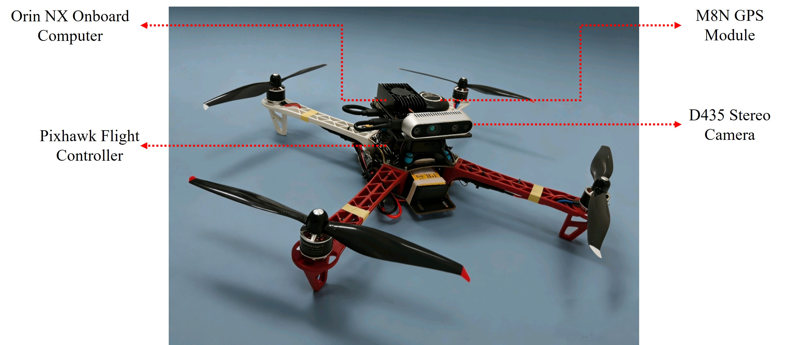
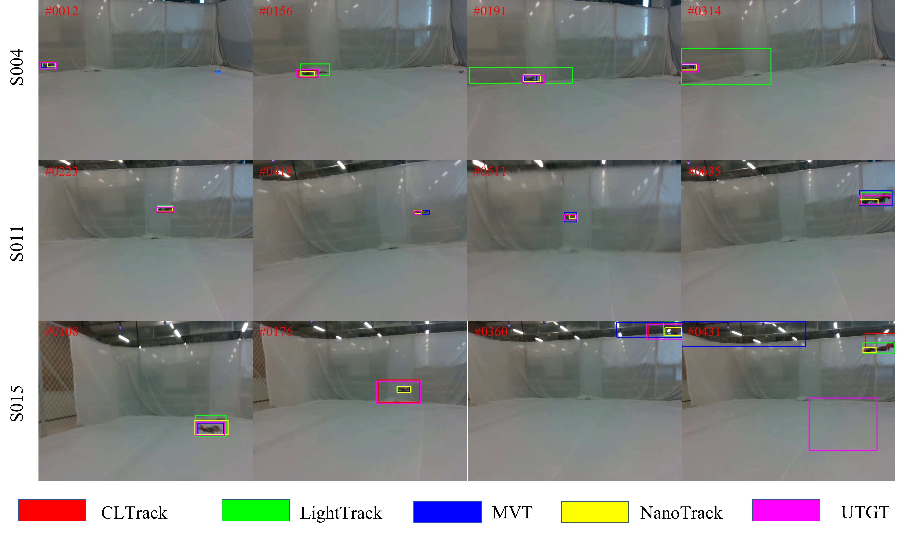

# Towards Real-Time UAV-Anti-UAV Tracking: An Embedded Hardware Platform and Lightweight Benchmark

## Introduction

This project focuses on the hardware and data foundation for real-time UAV-Anti-UAV tracking. We construct a dedicated UAV hardware platform and introduce a new dataset to facilitate the evaluation of lightweight tracking algorithms in realistic, resource-constrained aerial environments.

### Key Contributions
- **Custom UAV Hardware Platform**: Integrates a visual perception module (Intel RealSense D435) with an embedded computing unit (NVIDIA Jetson Orin NX 8GB) for real-time inference.
- **EA2A-UAV Dataset**: A specialized Embedded Airborne-to-Air UAV tracking dataset consisting of 22 sequences with 14,836 annotated frames, covering various flight maneuvers and dual-dynamic disturbances.
- **Lightweight Benchmark**: Systematic evaluation of 5 mainstream lightweight tracking algorithms directly on the embedded edge device.

## System Architecture

The platform prioritizes maximum computing power while maintaining flight maneuverability and stability.

| Component | Specification |
| :--- | :--- |
| **Frame** | F450 High-strength carbon fiber |
| **Compute Unit** | NVIDIA Jetson Orin NX (8GB) |
| **Camera** | Intel RealSense D435 (RGB-D) |
| **Flight Controller** | Pixhawk 2.4.8 (PX4 Firmware) |
| **Power System** | 2312 KV800 Motors + 35A ESC |

*Fig 1. The constructed UAV hardware platform for UAV-Anti-UAV tracking.*

## EA2A-UAV Dataset

The EA2A-UAV (Embedded Airborne-to-Air UAV) dataset captures the coupled egomotion and target motion inherent to UAV-to-UAV engagements.

- **Scale**: 22 sequences, 14,836 frames.
- **Resolution**: 640 x 480 @ 60 FPS.
- **Attributes**: Fast Movement (FM), Motion Blur (MB), Out-of-View (OV), Background Clutter, etc.

*Fig 2. Representative samples from the EA2A-UAV dataset showcasing diverse UAV targets and maneuvers.*

## Quantitative Evaluation

Evaluation of representative lightweight trackers on the Jetson Orin NX module using the One-Pass Evaluation (OPE) protocol.

| Tracker | Succ | Prec | Params (M) | MACs (G) |
| :--- | :---: | :---: | :---: | :---: |
| **LightTrack** | **0.7308** | **0.8891** | 1.96 | 0.73 |
| MVT | 0.7233 | 0.8517 | 5.47 | 3.34 |
| UTGT | 0.6954 | 0.8867 | 2.88 | 0.91 |
| NanoTrackV2 | 0.6952 | 0.8771 | **0.33** | **0.086** |
| CLTrack | 0.6887 | 0.8802 | 3.88 | 1.31 |

## Qualitative Results

*Fig 3. Qualitative tracking results of five lightweight trackers on challenging sequences (Motion Blur, Out-of-View, etc.).*

## Availability

- **Dataset**: Coming soon.
